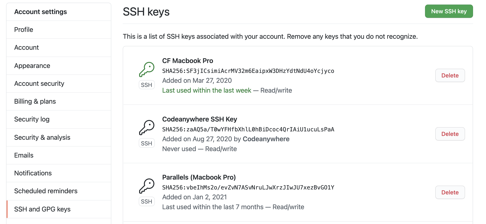
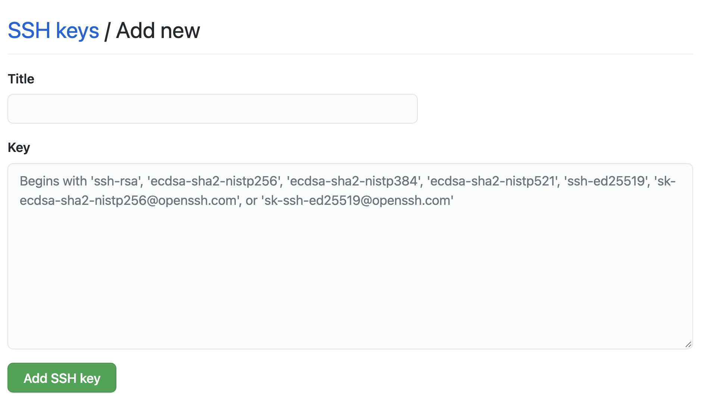
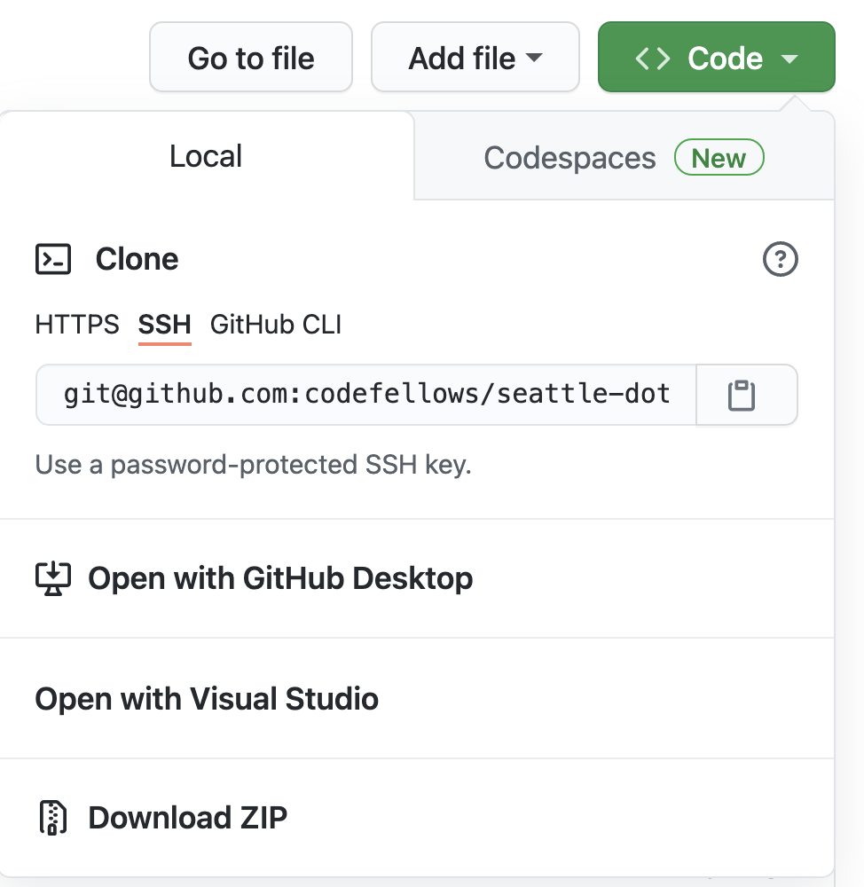

# Git

## Install and Configure Git and GitHub

Run the following command to ensure that you have the most recent version of `git`:

`brew install git || brew upgrade git`

## Setup GitHub for "SSH Authentication"

In order to use Git locally in a secure manner, we need to connect our computer with github.com using what's called "SSH Authorization", which is a way that we can consistently connect to github without sending our username and password every time we perform a command

[GitHub Instructions: Gerarate SSH Key](https://docs.github.com/en/github/authenticating-to-github/connecting-to-github-with-ssh/generating-a-new-ssh-key-and-adding-it-to-the-ssh-agent)


1. Create an "SSH Key"
   - Head to your terminal and enter the following command (using the email address you sign into GitHub with)

     ```bash
     ssh-keygen -t rsa -b 4096 -C "youremail@example.com"
     ```

- This will prompt you for a file location. Just accept the default

    ```bash
    Enter file in which to save the key (/Users/yourname/.ssh/id_rsa):
    ```

- It will then prompt you for a password to lock down this file. Enter one you can remember.

    > Note that you are free to leave this blank if you want to avoid typing passwords every time you use git. It's fine, although not terribly secure if someone gets ahold of your laptop

    ```bash
    Enter passphrase (empty for no passphrase):
    ```

- Once complete, it'll give you output that looks similar to this:

    ```text
    you@machine ~ $ ssh-keygen -t rsa -b 4096 -C "me@examplecom"
    you@machine
    Generating public/private rsa key pair.
    Enter file in which to save the key (/Users/yourname/.ssh/id_rsa):
    Enter passphrase (empty for no passphrase):
    Enter same passphrase again:
    Your identification has been saved in /Users/yourname/.ssh/id_rsa.
    Your public key has been saved in /Users/yourname/.ssh/id_rsa.pub.
    The key fingerprint is:
    SHA256:ki0TNHm8qIvpH7/c0qQmdv2xxhYHCwlpn3+rVhKVeDo USEFUL-COMMENT
    The key's randomart image is:
    +---[RSA 4096]----+
    |      o+   . .   |
    |     .=.o . +    |
    |     ..= + +     |
    |      .+* E      |
    |     .= So =     |
    |    .  +. = +    |
    |   o.. = ..* .   |
    |  o ++=.o =o.    |
    | ..o.++o.=+.     |
    +----[SHA256]-----+
    ```

1. Give that key to GitHub

   - Type this command to see your new key:

     ```bash
     cat ~/.ssh/id_rsa.pub
     ```

   - It'll look like a bunch of random letters, like this:

     ```text
     ssh-rsa AAAAB3NzaC1yc2EAAAADAQABAAACAQC1PqLEQoHNtq0Nx0IyIKQxXj91oSdTU0F2LA5FnCRPSJLBplzBtlkZdG9JLX
     +2EsrfpAMpP7FPU2hKt1swmPLp3HrbPI3ziNyyPX9Mj/5qpANYv+9QiKs6X9iApsfl0r985BE0XthFqJNYzBKM
     +q6bM1F5gKSBWX+t0RpTWn5lMnE970na52vQFVU7whQwmq1OxmzMzKlPtWA5xLF8b/
     fvWzKPkj0d9pCd752zw4H2Rm2T1huqxYFx4i6y3Cv5fUIF2/B
     4WU1GUUiIrH3s0XCW7UxUnkFCOWJUZ3XFlkBvOftxN8mocMhaip1xsoOr2tWIYgrABcmFOE9vXKE7Z64ILO+
     1vjM3JzO660jBUYJfkOfWKRm1P/BDTqLG+4A7das8aJa+kQJHMrLR8BhlSnxZVHiNhbrGHaKcH8CZVuF/
     ATdnT44EtyKgR433A7WwzLbr22vsMw4iU5HNwXHbnUY+5SD5Lw/ZngnXm1m5A4jP/7MBs4eJlYw6+K+HiNIze
     +9w10TsmcaDlNcHckn8/
     22OzY6Qph3qx2NBWcZ42XcBKNDLnwgztdbNNA32R85UrCWb0v7XgO2YgthsKSGxtA3wSL32BWfJwlrkLuUJvLQ=
     = yourname@example.com
     ```

   - You'll need to copy that and paste it into GitHub. There are 3 ways to do this
   
      - Mac Users: Run `pbcopy < ~/.ssh/id_ed25519.pub` to copy key to ckipboard.
      - Linux / Windows Users can use `xclip` to do this
        - `sudo apt-get install xclip` installs xclip
        - `clip -selection clipboard < ~/.ssh/id_ed25519.pub` to copy key to clipboard
      - Or, you can do this the old fashioned way and Highlight the text and copy it to your clipboard
        - Note: Copy all of it, from the `ssh-rsa` to your email address at the end
        
   - Now that you have this in your clip board, get it into GitHub ...

     - Login to your GitHub Account

     - Go to your settings page
       - Click the down arrow next your icon on the top right and choose **"Settings"**
       

     - From the settings window, choose the **"SSH and GPG Keys"** menu option
       

     - Click the green button labeled "New SSH Key"

     - On the next screen you'll see 2 inputs
       - In the first one, give you key a name, like "My Computer"
       - In the second box, paste in the key you copied in the previous step

     - Press the **Add SSH Key** button
       

1. Add the key to your computer's **ssh-agent**
   - The ssh-agent is a service that your computer will run to securely manage your keys

   - Type this command to start and verify your **ssh-agent** is running properly

     ```bash
     eval "$(ssh-agent -s)"
     ```

   - If it is, you should see output that looks like this:

     ```bash
     Agent pid 95727
     ```

     > NOTE: Depending on your environment, you may need to use a different command. For example, you may need to use root access by running sudo -s -H before starting the ssh-agent, or you may need to use exec ssh-agent bash or exec ssh-agent zsh to run the ssh-agent.

   - Now, let's let the **ssh-agent** know about our key. Type this command:

     - Mac Users:

       ```bash
       ssh-add -K ~/.ssh/id_rsa
       ```

     - Window and Linux Users:

       ```bash
       ssh-add ~/.ssh/id_rsa
       ```

     - You should see a success message like this:

       ```bash
       Identity added: /Users/johncokos/.ssh/id_rsa (you@example.com)
       ```

   - For Mac Users, you'll also need to create an extra config file. Enter this command:
     - Open the config file `nano ~/.ssh/config`
     - Add the following to the editor:

       ```bash
       Host *
         AddKeysToAgent yes
         UseKeychain yes
         IdentityFile ~/.ssh/id_ed25519
       ```

      - Press `ctrl-x` then press `y` then press `enter`

1. Test it out!

     - Try a test connection to GitHub:

       ```bash
       ssh -T git@github.com
       ```

     - You should get confirmation that looks something like this ... congratulations!

       ```bash
       Hi yourname! You've successfully authenticated, but GitHub does not provide shell access.
       ```

1. Now, when you go to GitHub to check out your code, make sure and choose the "SSH" option and use that as the source of your `clone`

   


## Git Config

Like artists, programmers sign their work. Let's configure Git to sign your commits with your name and email address.

**WARNING:** Before running the following commands one line at at time, replace `YOUR FULL NAME` and `YOUR EMAIL ADDRESS` with the name and email from [Your GitHub Account](https://github.com/settings/profile)

```bash
git config --global user.name 'YOUR FULL NAME'
```

```bash
git config --global user.email 'YOUR EMAIL ADDRESS'
```

```bash
git config --global core.editor "code --wait"
```

### [⇐ Previous](4-node) | [Next ⇒](6-tree)
