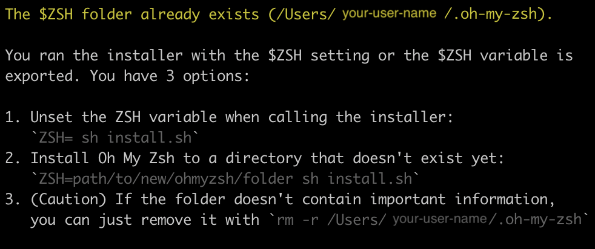

# Oh-My-Zsh

Now it's time to unleash your terminal's potential! In this section we'll update the terminal's look and feel, as well as add some color.

---

The following instructions are pulled from [Oh My Zsh.](https://ohmyz.sh/)

In your terminal, run the following command to install Oh My Zsh:

- `sh -c "$(curl -fsSL https://raw.github.com/ohmyzsh/ohmyzsh/master/tools/install.sh)"`

CLICK HERE only if you see a message similar to:

Congratulations! If you see this message in your terminal, it means Oh-My-Zsh is already installed. Continue to the [next page!](./7-node.md)

If you don't see a message in your terminal like the one above, continue with the setup steps.

**NOTE:** You may get a questions asking if you want to update your terminal to `zsh`. **Select `yes` for this.** If any warnings or errors occur, be sure to complete what is being suggested or get help.

> _AT THIS POINT YOU **`MUST`** RESTART YOUR TERMINAL_

---

## Confirming Setup

Re-open your terminal and run the following command to verify everything is still set up correctly:

- `brew --version`

CLICK HERE if the output is <code>Homebrew 3.5</code> or higher

You're ready to continue to the [next page.](./7-node.md)

 

Otherwise CLICK HERE if you get an error such as <code>zsh: command not found: brew</code>

Run the following commands:

- `echo 'export BREW_HOME="/home/linuxbrew/.linuxbrew/bin"' >> $HOME/.zshrc`
- `echo 'export PATH="$PATH:$BREW_HOME"' >> $HOME/.zshrc`
- `reset`

Check again for confirmation with the command:

- `brew --version`

You should see `Homebrew 3.5` or higher

**If you are still getting errors at this point, [click here](../../error/error.md) and do not continue with the following steps until you have Oh-My-Zsh properly installed**

---

## Bookmark

Bookmark these sites to reference later through other classes as needed:

- Lots of customization available on their [Github repo.](https://github.com/ohmyzsh/ohmyzsh/)
- This is a link to a [cheatsheet.](https://github.com/ohmyzsh/ohmyzsh/wiki/Cheatsheet)

---

### [⇐ Previous](./5-tree.md) | [Next ⇒](./7-node.md)
