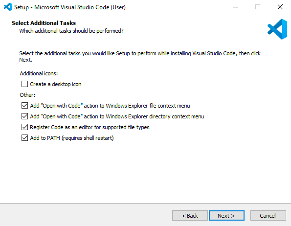

# Install VSCode Text Editor

Now it's time to install the Visual Studio Code (VSCode) text editor, a sophisticated text editor for code, markup, and prose.

> **Follow the below instructions in order**, paying attention to any notes specific to your operating system.

---

## Get Started

- Close any open terminal windows.
- Download [VSCode](https://code.visualstudio.com/download) and install.
- If this window displays during set up, be sure the following boxes are selected.

- Before launching the application, **move VSCode from your downloads folder to your applications folder**.
- Launch The VS Code Application  .
- Open the **Command Palette** (press ⌘+shift+p keys) and type 'shell command'.
- Select the option that says: **Shell Command: Install 'code' command in PATH**.
- Close VS Code and close your terminal.

---

## Install Required VSCode Extensions

We'll now be adding some functionality to your new code editor by installing a number of extensions.

- Re-open your terminal and run the command:
  - `code .`
- On the bottom left hand side you will see a settings ("gear") icon.
- Click this, then select "Extensions".
- A side-bar will slide out and at the top you can search for the listed extensions below, and click the 'Install' button for each:
  - liveserver
  - ESLint
  - markdownlint
  - editorconfig
  - HTML Preview
  - Thunder Client

There are many other extensions to choose from that will make your coding life a lot easier. Your instructors, TAs and classmates will all be great resources as to what works well for them.

[VSCode's documentation](https://code.visualstudio.com/docs) is excellent. Review it now to familiarize yourself with the basics.

---

### [⇐ Previous](./8-eslint.md) | [Next ⇒](./10-verify.md)
