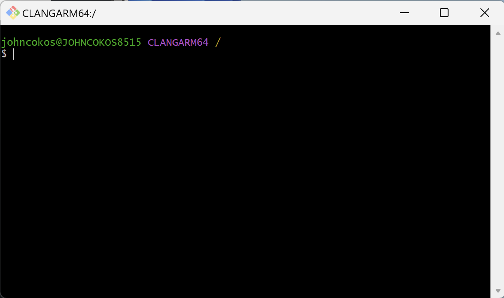

# Git

Git is a free, open-source distributed version control system. You'll use it to track the history of changes to your files, collaborate with others, and more!

---

## Verify if GitBash is already installed:

Search for and open the app called `git bash` on your computer. If this application is already installed, then skip to the [next step](./2-gh.md)

## Download GitBash

1. Navigate to the [Git](https://git-scm.com/downloads) download page.
1. Click to download button.
1. Once the installer downloads, open the file and begin the installation process.

## Install GitBash

Once the installer begins, you'll be presented with a series of pop-ups asking you to make some configuration choices and then press the "Next" button to continue the process. Use these notes as a guide:

1. **Select Components**: Choose all options.
2. **Choose Default Editor**: Select Notepad.
3. **Initial Branch**: Choose the "Override" option and leave its default as `main`.
4. **Path**: Choose "Git from the command line and also from 3rd party software".
5. **OpenSSH**: Choose "Use bundled OpenSSH".
6. **OpenSSL**: Choose "Use the OpenSSL Library".
7. **Line Ending Conversions**: Choose "Checkout Windows-style, commit Unix-style".
8. **Terminal Emulator**: Choose "Use Windows Terminal".
9. **Default Behavior for 'git pull'**: Choose "Fast Forward or Merge".
10. **Credentials Manager**: Choose "git credential manager".
11. **Extra Options**: Check only "Enable filesystem caching".
12. **Experimental Options**: Do not check any of the options

When installation is complete, check the "Launch GitBash" option and then click the "Finish" button

GitBash should now be an open window that looks like the image below.

> We recommend that you Right Click the GitBash or Terminal icon in your task bar and choose the "Pin to Taskbar" option so that it's easy to re-open GitBash in the future

Like artists, programmers sign their work. Let's configure Git to sign your commits with your name and email address.

**WARNING:**

Before running the following commands one line at a time, use the arrow keys or backspace/delete keys on your keyboard to move your cursor.

Replace `YOUR FULL NAME` and `YOUR EMAIL ADDRESS` inside the single quotes with the name and email from [Your GitHub Account](https://github.com/settings/profile)

- `git config --global user.name 'YOUR FULL NAME'`
- `git config --global user.email 'YOUR EMAIL ADDRESS'`
- `git config --global core.editor "code --wait"`
- `git config --global init.defaultbranch main`

### [⇐ Previous](./README.md) | [Next ⇒](./2-gh.md)
