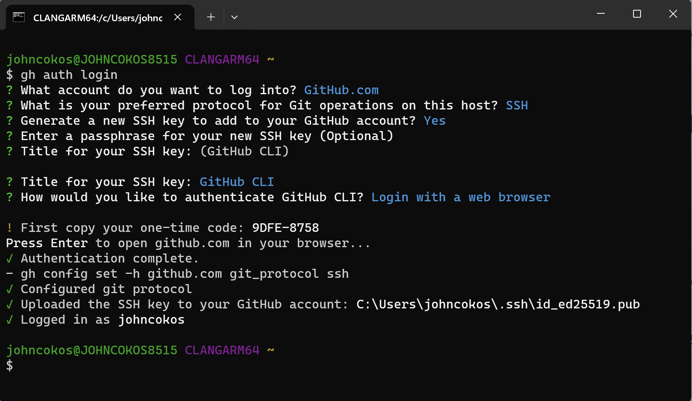

# Git Command Line Tool

Install the `gh` command line tool from GitHub

---

1. Close any open **GitBash** windows you may have open.
1. Navigate to the [GitHub CLI] download page.
1. Click to download button.
1. Once the installer downloads, open the file and follow the on-screen instructions.

## Setup GitHub for "Authentication"

In order to use Git locally in a secure manner, we need to connect our computer with github.com. (_For further information about this process, visit [GitHub Instructions: Caching GitHub credentials](https://docs.github.com/en/get-started/getting-started-with-git/caching-your-github-credentials-in-git)_)

Open the **GitBash** application.

- Once opened, run this command:
  - `gh auth login`
- Use arrow keys to select **GitHub.com**
- Select **SSH**
- When prompted with `Generate a new SSH Key to add to your GitHub account (Y / n)`, press `y` and enter
- When prompted to enter a passphrase, you may enter a new passphprase here press enter to skip this step.
  - Skipping this step removes the burden of having to re-enter your password every time you use this tool from your laptop.
  - It also means that anyone with access to your laptop can access your github account
- Press "Enter" when prompted to give a Title for your SSH key.
- When prompted with `Authenticate Git with your GitHub credentials (Y / n)`, press `y` and enter
- Select **Login with a web browser**
- Copy the one time code shown in yout terminal and then press enter. This will open GitHub.com in a web page.
- If not signed in, you will be prompted to sign in.
- GitHub will prompt you for the one time code you copied from the terminal. Paste/enter it in the appropriate boxes.
- Click **Authorize GitHub**
- You can close the web browser and press enter in your terminal to continue.

Your terminal should confirm that you have authenticated successfully:

### [⇐ Previous](./1-gitbash.md) | [Next ⇒](./3-vscode.md)
