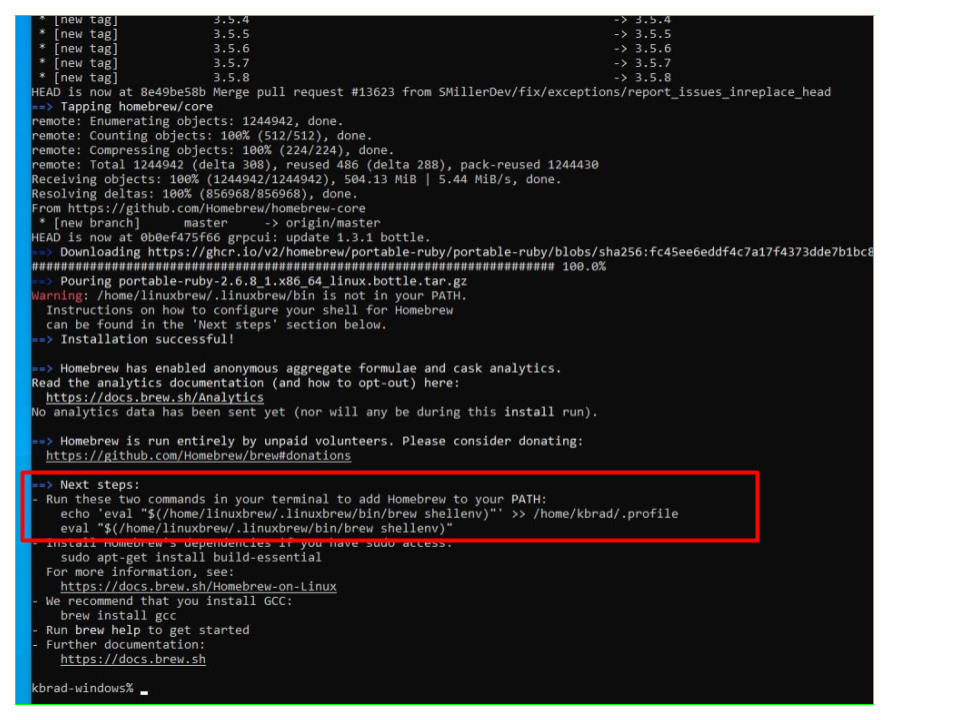

# Install "Homebrew"

Homebrew is a tool that simplifies installing applications on your machine. Think of it like an app store for your computer.

---

## Verify if Homebrew is already installed

- In your terminal, run: `brew --version`
  - *If output is similar to:* `Homebrew 3.4.11`
    - Run: `brew update` to get latest updates
    - Move on to [next page](./4-git.md)
  - *If output is not similar to the above*, continue with instructions on this page.

---

In your terminal, enter the following command:

- `/bin/bash -c "$(curl -fsSL https://raw.githubusercontent.com/Homebrew/install/HEAD/install.sh)"`
- You will be prompted several times along the way. Enter your password when prompted, accept all the defaults, say "Yes" if prompted. (***Note:*** *You will not have any visual feedback on your screen as you type. It is protecting your password by not displaying ANYTHING at all to the screen, but it is registering your key strokes.*)
- Once the main installation finishes (could take up to 30 minutes), **look at the output at the bottom of your terminal**. You may see an arrow pointing to "Next Steps" line with 2 commands.



- Enter those commands, one at a time in your terminal - they should produce no errors, and do not produce success messages.

- Then enter these commands, one at a time in your terminal - they should produce no errors, and do not produce success messages:
  - `test -d ~/.linuxbrew && eval $(~/.linuxbrew/bin/brew shellenv)`
  - `test -d /home/linuxbrew/.linuxbrew && eval $(/home/linuxbrew/.linuxbrew/bin/brew shellenv)`

Once the installation has completed, **run:**

 `brew doctor`

**if** return output is:

```bash
Your system is ready to brew
```

**or** return output is:

```text
Please note that these warnings are just used to help the Homebrew maintainers
with debugging if you file an issue. If everything you use Homebrew for is
working fine: please don't worry or file an issue; just ignore this. Thanks!
```

**then run:**

`brew update`

**else if**  return output is:

```bash
brew: command not found
```

**then** run these commands

1. ```echo 'export BREW_HOME="/home/linuxbrew/.linuxbrew/bin"' >> $HOME/.zprofile``` 
1. ```echo 'export PATH="$PATH:$BREW_HOME"' >> $HOME/.zprofile``` 
1. ```reset```


> **If `brew update` still fails to run, [click here](../../error/error.md) and do not continue with the following steps until you have Homebrew properly installed**

## Install "gcc"

In order for Homebrew to install other applications, it needs a tool called **gcc** to assist itself.

Run this command in your terminal:

`brew install gcc`

When that completes, you will be returned to the command prompt and can move on to the next steps.

---

### [⇐ Previous](./2-apt.md) | [Next ⇒](./4-git.md)
