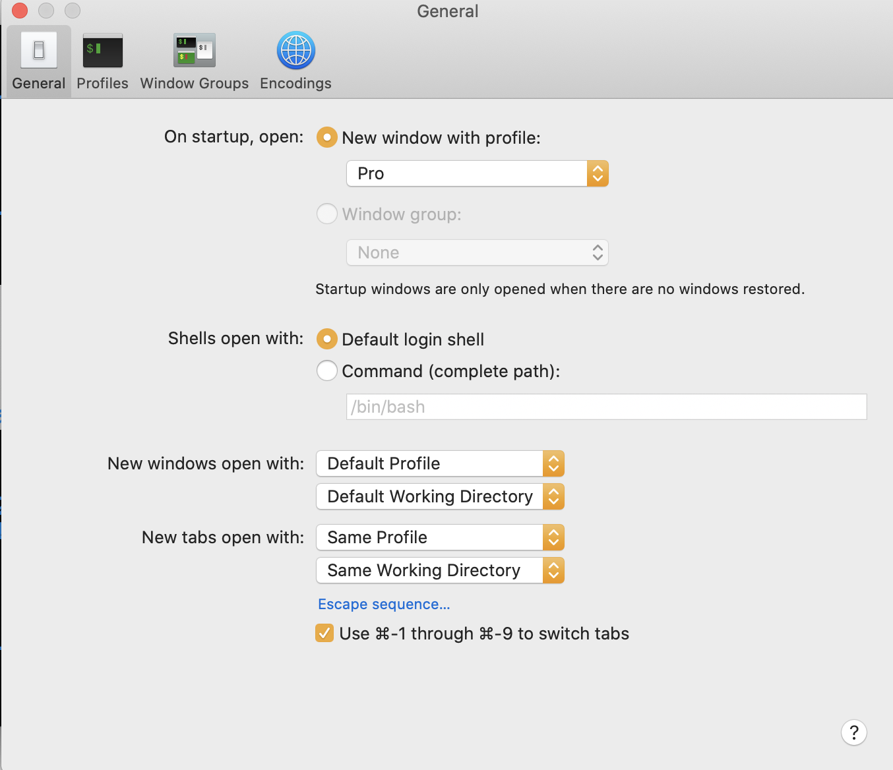

# Terminal > Preferences

Go to Terminal menu > Preferences > General tab

Make yours look like the image below:



**Close** this window and quit the Terminal

Reopen a new terminal.

**Run:**

`echo $SHELL`

Expected output should be:

```
/bin/bash
```

---

Did you get the expected output?

[Yes](../git/git-prompt.md)

[No](../../error/error.md)

---
### [⇐ Previous](zsh.md)