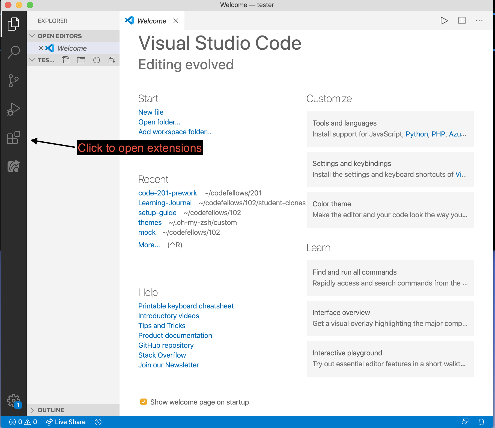

# Install Extensions in VS Code

**Run:**

`mkdir tester && cd tester && code .`

VS Code should open.

**Click** on the four boxes to open the extension marketplace.

---

A search field will open.  **Search and install** each extension from this list:

NOTE: Some extensions may require you to reload VSCode.

- Live Server 5.6.1
- ESLint 2.1.2
- Debugger for Chrome 4.12.6
- HTML Preview 0.2.5  (the one with 4.5 stars)
- markdownlint 0.34.0
- Markdown All in One 2.7.0

---

## [Continue to Final Verification](../test/test.md)

[Click here if you are stuck.](../../error/error.md)

---
### [⇐ Previous](../git/git-config.md)