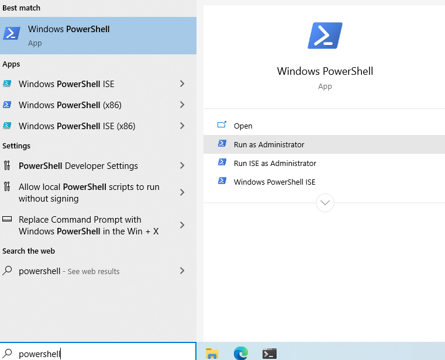

# Setting up WSL Version 2 and the Ubuntu app

## Overview

**You are not expected to understand what is taking place as you complete the steps in this guide. It is important that you do not skip ahead.  Please follow the instructions line by line.**

Windows does not run in a POSIX environment. Much of the software you use as a developer is designed to run in POSIX environments, and many of the web's servers are also running in some POSIX environment. This causes problems because Windows uses different console commands and not all of those commands translate over to POSIX very well.

Windows has released a feature available to all PCs running on Windows 10 called Windows Subsystem for Linux, otherwise known as WSL. WSL gives you the ability to add a Linux "distro" like Ubuntu and mount it directly to the Windows File System.

**Ubuntu can _read and write_ both** Ubuntu and Windows files, **Windows can only _read and write_ Windows files**, and **_read_ Ubuntu Files**, but it **_cannot_ write Ubuntu files**. Knowing which files belong to which FS is important because of this.

Before we dive into how to use the Ubuntu App and WSL, lets talk about one of the most important things, which is **knowing your File Systems**

There are 2 files systems here:

1. The Windows FS
2. The Ubuntu FS.

## Install Instructions

Please read through these steps before getting started

**Follow the instructions line for line, pay attention to detail!!**

### 1. Install the most recent version of Windows 10

For setting up a modern development environment, we will require that you're running the latest version of Windows 10 and have WSL Version 2 installed.

> **NOTE:** WSL 2 is only available in Windows 10, Version 2004, Build 19041 or higher. You may need to update your Windows version. Check your windows version in settings before moving on.

If your version does not match the above criteria, you'll need to do an update of Windows. This link will allow you to install Microsoft's Update Manager making the upgrade process very easy. Download and install the application and follow the instructions. <https://www.microsoft.com/en-us/software-download/windows10>

### 2. Enable WSL Feature in Windows

> **NOTE**: The following instructions are summarized from the [Microsoft WSL2 Upgrade Documentation](https://docs.microsoft.com/en-us/windows/wsl/install-win10#update-to-wsl-2)

1. Right click on the start menu and click on Settings.
1. In the Search box, type `Turn Windows Features On Or Off` and click on the item that populates in the list.
1. A window will pop up with a list of folders with checkboxes next to them.
   - Scroll down and check the boxes for
     - `Virtual Machine Platform1`
     - `Windows Hypervisor Platform`
     - `Windows Subsystem for Linux`
1. Once this operation is complete, you will need to restart your system and then continue the steps below
   - NOTE: This page might not open after restart, so be sure to make note of the url or bookmark it.
1. Open Windows "Powershell"

      

1. Enter the following command to set your system default to WSL 2
   - `wsl --set-default-version 2`
   - Windows should respond with no errors and a message such as this:
     `For information on key differences with WSL 2 please visit https://aka.ms/wsl2`

#### 2. Install the Ubuntu app from the Windows Store

1. Click here to go to Microsoft store and click "GET" to install the [Ubuntu App](https://www.microsoft.com/en-us/p/ubuntu-2004-lts/9n6svws3rx71?activetab=pivot:overviewtab)
1. When the app is ready, it will prompt you to **Launch**. Click the Launch button. This will start the Ubuntu installation. This installation only happens the first time the app is launched, as it's the actual Ubuntu OS installing and mounting to your Windows FS. Anytime you uninstall the app and reinstall it you will have to do this process again. Make sure to back up important data if you ever uninstall this app, as it is not preserved.

#### 3. Finish Installing the Ubuntu App

1. It will ask you to enter a username.
1. It will then ask you to enter and confirm a password.
   - It's recommended it's not too long as you may have to type it a lot. Also note that it will protect your password by not displaying it to the screen when you type, but it is registering your key strokes.
1. Finally, the prompt will change and you will be on a command line. Type `pwd` to see where you currently are in the FS, you should be at `/home/<your username>`. **This is the root level of your Ubuntu user.**

#### 4. Verify that you are running WSL Version 2

1. Open Powershell
1. Run the following command:
   - `wsl -l -v`
   - You should see a report such as this, which should confirm your WSL Version

     ```bash
     PS C:\Users\yourname> wsl -l -v
     NAME                   STATE           VERSION
     Ubuntu-20.04           Running         2
     ```

1. If your version states version 1, you might need to take an additional step to update Ubuntu
   - Enter the following command (replace Ubuntu-20.04 with the actual version you installed):
   - `wsl --set-version Ubuntu-20.04 2`
   - This will take a fair amount of time to complete
   - Re-Run the command above to verify your version

### 3. Install Windows Terminal

- Open [this link](https://www.microsoft.com/en-us/p/windows-terminal/9n0dx20hk701?activetab=pivot:overviewtab) to download and install "Windows Terminal" from the Microsoft Store.
- This will allow you have multiple Ubuntu "tabs" open at once, which makes development a lot easier

> **TIP:** When we refer to "Terminal" throughout this guide, you should open this application up, and select Ubuntu in a new tab.

### 4. Updating Default Software

Once you have your system up to date, you are ready to complete the software installation process

---

### [Next ⇒](../system-setup/README.md)
